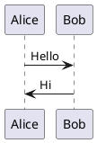

# Hướng dẫn cài và sử dụng PlantUML trong Visual Studio Code và IntelliJ IDEA

## 1. Cài đặt và sử dụng PlantUML trong Visual Studio Code

### Bước 1: Cài đặt PlantUML extension
1. Mở **Visual Studio Code**.
2. Vào **Extensions** (hoặc nhấn `Ctrl + Shift + X`).
3. Tìm kiếm extension **PlantUML**.
4. Chọn **PlantUML** của **jebbs** và nhấn **Install**.

### Bước 2: Cài đặt Java và Graphviz (nếu chưa có)
- **Java**: PlantUML yêu cầu Java để chạy, nên bạn cần cài Java Development Kit (JDK).
  - Tải và cài đặt JDK tại [Oracle JDK](https://www.oracle.com/java/technologies/javase-jdk11-downloads.html).
  - Sau khi cài đặt, kiểm tra bằng cách chạy `java -version` trong terminal.

- **Graphviz**: Cần cài Graphviz để vẽ sơ đồ.
  - Tải và cài đặt tại [Graphviz](https://graphviz.gitlab.io/download/).
  - Sau khi cài, kiểm tra bằng cách chạy `dot -V` trong terminal.

### Bước 3: Cấu hình PlantUML trong Visual Studio Code
1. Sau khi cài đặt extension, mở file `.puml` trong VS Code.
2. Bạn có thể viết sơ đồ UML như sau:



3. Để xem kết quả sơ đồ, nhấn chuột phải vào file `.puml` và chọn **PlantUML: Preview Current Diagram**.

### Bước 4: Xuất sơ đồ
- Để xuất sơ đồ thành hình ảnh (PNG, SVG, PDF), bạn có thể nhấn chuột phải vào file `.puml` và chọn **PlantUML: Export Current Diagram**.

---

## 2. Cài đặt và sử dụng PlantUML trong IntelliJ IDEA

### Bước 1: Cài đặt Plugin PlantUML
1. Mở **IntelliJ IDEA**.
2. Vào **File > Settings** (hoặc **Ctrl + Alt + S**).
3. Chọn **Plugins** và tìm kiếm **PlantUML**.
4. Cài đặt plugin **PlantUML Integration**.

### Bước 2: Cài đặt Java và Graphviz (nếu chưa có)
- Giống như trong Visual Studio Code, bạn cần cài **Java** và **Graphviz**.

### Bước 3: Cấu hình PlantUML trong IntelliJ IDEA
1. Tạo một file mới với đuôi `.puml`.
2. Viết sơ đồ UML trong file:


3. Để xem sơ đồ, mở file `.puml` và bạn sẽ thấy biểu đồ được hiển thị trực tiếp trong IntelliJ IDEA.

### Bước 4: Xuất sơ đồ
- Bạn có thể xuất sơ đồ bằng cách nhấn vào **File > Save As** và chọn định dạng hình ảnh bạn muốn xuất.

---

## 3. Một số lưu ý khi sử dụng PlantUML

- **Cấu trúc cơ bản của PlantUML**:
  - `@startuml` và `@enduml` đánh dấu sự bắt đầu và kết thúc của sơ đồ.
  - Các mối quan hệ giữa các đối tượng được thể hiện bằng các mũi tên (`->`, `<-`, `-->`, `-->`).
  - Trong Visual Studio để preview được sơ đồ bấm tổ hợp phím Alt+D.
- **Các loại sơ đồ**:
  - **Sơ đồ tuần tự (Sequence Diagram)**:
    ```plantuml
    @startuml
    Alice -> Bob: Hello
    Bob -> Alice: Hi
    @enduml
    ```

  - **Sơ đồ lớp (Class Diagram)**:
    ```plantuml
    @startuml
    class Car {
      +String model
      +int speed
    }
    @enduml
    ```

  - **Sơ đồ trạng thái (State Diagram)**:
    ```plantuml
    @startuml
    [*] --> State1
    State1 --> [*]
    @enduml
    ```

---

## 4. Tài nguyên tham khảo
- [Trang chính PlantUML](https://plantuml.com/)
- [Tài liệu hướng dẫn PlantUML](https://plantuml.com/guide)

---

Chúc bạn thành công khi sử dụng PlantUML để vẽ sơ đồ trong các công cụ phát triển!
