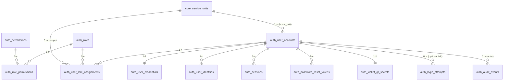

# Auth Schema (PostgreSQL) — Đăng nhập & Phân quyền cho hệ thống ví sinh viên

Tài liệu này mô tả **ý nghĩa**, **quan hệ**, và **vai trò nghiệp vụ** của các bảng trong schema `auth` (PostgreSQL) đã thiết kế để phục vụ:
- Đăng nhập đa phương thức (email/phone/mã sinh viên/thẻ)
- Quản lý thông tin xác thực (mật khẩu, MFA)
- Quản lý phiên đăng nhập (refresh token/session)
- Theo dõi đăng nhập (anti-bruteforce, audit)
- Phân quyền theo mô hình **RBAC** (Role-Based Access Control), có **scope theo đơn vị dịch vụ**
- Audit trail cho các hành động nhạy cảm

> Phạm vi tài liệu: **schema `auth`**. Các bảng thuộc schema `core` (ví dụ `core.service_units`) chỉ được nhắc để giải thích quan hệ.

---

## 1) Mục tiêu thiết kế và bài toán cần giải quyết

Trong bài toán ví sinh viên, hệ thống thường có nhiều nhóm người dùng:
- Sinh viên đăng nhập để xem thông tin ví, tạo QR thanh toán, giao dịch.
- Nhân viên quầy/đơn vị dịch vụ (POS) đăng nhập để thu tiền, tra cứu theo phạm vi đơn vị.
- Tài vụ/kế toán xử lý nạp tiền mặt/hoàn tiền/đối soát.
- Quản trị hệ thống quản lý người dùng, phân quyền, cấu hình.

Từ đó, schema `auth` phải giải quyết tối thiểu các yêu cầu kỹ thuật sau:

1. **Đăng nhập an toàn và có thể mở rộng**  
   - Tách bạch danh tính người dùng, thông tin xác thực, và cơ chế đăng nhập.
   - Dễ mở rộng thêm phương thức đăng nhập/định danh (thẻ, SSO, OTP…).

2. **Chống tấn công đoán mật khẩu**  
   - Lưu lịch sử login attempts.
   - Cơ chế lockout/locked_until.

3. **Quản lý phiên đăng nhập**  
   - Hỗ trợ refresh token (hoặc session) có thể revoke.
   - Ghi nhận thiết bị/IP để phục vụ bảo mật.

4. **Phân quyền chuẩn hoá và tối ưu hiệu năng**  
   - RBAC: user → roles → permissions.
   - Có **scope theo đơn vị dịch vụ** để nhân viên chỉ thao tác trong phạm vi được cấp.

5. **Audit trail**  
   - Ghi log hành động quan trọng: đăng nhập, cấp quyền, khoá tài khoản/ví, revoke token, thay đổi cấu hình.

6. **Hỗ trợ QR ví thay đổi định kỳ (TTL/rotation)**  
   - Lưu secret/metadata để server tạo và kiểm tra QR theo thời gian, tránh lưu QR plaintext.

---

## 2) Tổng quan mô hình dữ liệu (quan hệ các bảng)

### 2.1 Sơ đồ quan hệ (Mermaid ERD)



> Lưu ý: Mermaid yêu cầu đặt tên bảng theo đúng tên hiển thị. Trong DB thực tế, tên bảng là:
> - `auth.user_accounts`, `auth.user_credentials`, `auth.user_identities`, `auth.sessions`, `auth.password_reset_tokens`,
>   `auth.wallet_qr_secrets`, `auth.roles`, `auth.permissions`, `auth.role_permissions`, `auth.user_role_assignments`,
>   `auth.login_attempts`, `auth.audit_events`
> - Bảng `core.service_units` thuộc schema `core`.

---

## 3) Mô tả chi tiết từng bảng trong schema `auth`

### 3.1 `auth.user_accounts` — Danh tính người dùng (Identity Core)

**Mục đích**
- Là bảng “gốc” đại diện cho **người dùng** trong hệ thống.
- Lưu thông tin danh tính cơ bản và trạng thái tài khoản.
- Là điểm neo FK cho credentials, sessions, RBAC, audit.

**Cột quan trọng**
- `id (uuid)`: khoá chính.
- `user_type`: phân loại người dùng: `STUDENT`, `SERVICE_STAFF`, `FINANCE`, `ADMIN`.
- `status`: vòng đời tài khoản: `PENDING`, `ACTIVE`, `SUSPENDED`, `LOCKED`, `DELETED`.
- `display_name`, `email`, `phone`: thông tin hiển thị/ liên hệ.
- `home_service_unit_id`: (tuỳ chọn) đơn vị “mặc định” của user (hữu ích cho staff).
- `deleted_at`: soft delete.

**Ràng buộc/Index**
- Unique `email`, unique `phone` (nếu có).
- Trigger cập nhật `updated_at`.

**Giải quyết yêu cầu bài toán**
- Chuẩn hoá quản lý người dùng cho nhiều nhóm (SV, nhân viên dịch vụ, tài vụ, admin).
- Hỗ trợ soft delete và trạng thái khoá/tạm ngưng.

---

### 3.2 `auth.user_credentials` — Thông tin xác thực (Password/MFA) (Credential Store)

**Mục đích**
- Lưu dữ liệu nhạy cảm phục vụ xác thực: hash mật khẩu, trạng thái MFA, thống kê fail.
- Tách khỏi `user_accounts` để giảm rủi ro và dễ thay đổi phương thức xác thực.

**Cột quan trọng**
- `user_id`: PK đồng thời là FK 1-1 tới `auth.user_accounts`.
- `password_hash`: hash bcrypt/argon2 (tạo ở application layer).
- `password_changed_at`
- `mfa`, `mfa_secret_enc`: MFA (ví dụ TOTP). `mfa_secret_enc` nên được mã hoá trước khi lưu.
- `failed_login_count`, `locked_until`: phục vụ lockout.
- `last_login_at`

**Giải quyết yêu cầu bài toán**
- Đăng nhập an toàn (hash password + MFA).
- Chống bruteforce (fail count + lockout).

---

### 3.3 `auth.user_identities` — Định danh đa phương thức (Multi-Identity)

**Mục đích**
- Cho phép một user có nhiều “định danh đăng nhập/định danh”: email, phone, mã SV, UID thẻ.
- Giải pháp “mở rộng” để tích hợp thẻ ra/vào hoặc đăng nhập bằng mã SV mà không phá cấu trúc.

**Cột quan trọng**
- `provider`: `EMAIL`, `PHONE`, `STUDENT_CODE`, `CARD_UID`
- `identifier`: giá trị định danh (đã normalize ở app).
- `is_primary`, `verified_at`

**Ràng buộc/Index**
- Unique `(provider, identifier)` đảm bảo một định danh không trỏ tới nhiều user.
- Index theo `user_id` và `(provider, identifier)` để lookup nhanh.

**Giải quyết yêu cầu bài toán**
- Hỗ trợ đăng nhập bằng nhiều loại định danh.
- Hỗ trợ mapping thẻ sinh viên (CARD_UID) và mã sinh viên.
- Hỗ trợ luồng verify (verified_at).

---

### 3.4 `auth.sessions` — Phiên đăng nhập/Refresh Token (Session Management)

**Mục đích**
- Quản lý phiên đăng nhập có thể thu hồi (revoke), phục vụ mô hình JWT + refresh token hoặc session-based.

**Cột quan trọng**
- `refresh_token_hash`: lưu **hash** của refresh token, không lưu plaintext.
- `issued_at`, `expires_at`, `revoked_at`
- `ip`, `user_agent`, `device_id`: phục vụ bảo mật/forensics.

**Index**
- `user_id` để list phiên theo user.
- `refresh_token_hash` để xác thực refresh token nhanh.

**Giải quyết yêu cầu bài toán**
- Cho phép đăng xuất khỏi mọi thiết bị, thu hồi token khi nghi ngờ lộ.
- Quản lý nhiều thiết bị đăng nhập đồng thời.

---

### 3.5 `auth.login_attempts` — Nhật ký đăng nhập (Anti-Bruteforce + Observability)

**Mục đích**
- Ghi nhận mọi lần đăng nhập (thành công/thất bại), phục vụ:
  - Phân tích tấn công bruteforce
  - Điều tra sự cố
  - Tuning lockout

**Cột quan trọng**
- `identifier`: định danh dùng để login (có thể email/phone/mã SV).
- `user_id`: nullable (khi không tìm thấy user vẫn ghi nhận).
- `success`, `failure_reason`, `ip`, `user_agent`

**Index**
- `occurred_at DESC` để query theo thời gian.
- `identifier` để truy vết theo định danh.

**Giải quyết yêu cầu bài toán**
- Bảo mật đăng nhập.
- Audit/forensics.

---

### 3.6 `auth.password_reset_tokens` — Token đặt lại mật khẩu (Password Reset)

**Mục đích**
- Hỗ trợ quy trình “quên mật khẩu” hoặc “reset password” do admin/flow tự phục vụ.

**Cột quan trọng**
- `token_hash`: hash token reset
- `expires_at`, `used_at`

**Giải quyết yêu cầu bài toán**
- Quy trình reset password an toàn, token dùng 1 lần (used_at) và có TTL.

---

### 3.7 `auth.wallet_qr_secrets` — Secret QR ví (QR Rotation / TTL)

**Mục đích**
- Hỗ trợ QR thanh toán thay đổi định kỳ (ví dụ mỗi 30–60s) và chỉ hợp lệ khi user đã xác thực.
- Bảng này **không lưu QR**; chỉ lưu secret/metadata để server tạo/validate QR theo time-slice.

**Cột quan trọng**
- `user_id`: 1-1 với user.
- `secret_enc`: secret mã hoá (khuyến nghị mã hoá ở app hoặc bằng KMS).
- `rotation_seconds`: chu kỳ thay đổi QR.
- `enabled`

**Giải quyết yêu cầu bài toán**
- QR có TTL/rotation để giảm rủi ro chụp màn hình/đánh cắp QR.
- Tách dữ liệu nhạy cảm, tránh lưu QR plaintext.

---

### 3.8 `auth.roles` — Vai trò (Role)

**Mục đích**
- Danh mục vai trò RBAC (ví dụ: `STUDENT`, `POS_OPERATOR`, `FINANCE_OFFICER`, `SYS_ADMIN`).
- Vai trò là “gói quyền”.

**Cột quan trọng**
- `code`: unique, dùng như định danh kỹ thuật.
- `is_system`: phân biệt role hệ thống hay role tuỳ biến.

**Giải quyết yêu cầu bài toán**
- Chuẩn hoá quản trị quyền theo role thay vì gán permission trực tiếp vào user.

---

### 3.9 `auth.permissions` — Quyền (Permission)

**Mục đích**
- Danh mục quyền “atomic”, ví dụ:
  - `wallet:read`, `pay:create`
  - `topup:cash:create`
  - `rbac:manage`, `user:manage`

**Giải quyết yêu cầu bài toán**
- Least-privilege: quyền nhỏ, ghép role tuỳ nhu cầu.
- Dễ audit: mỗi endpoint/feature map tới 1 permission.

---

### 3.10 `auth.role_permissions` — Ánh xạ Role ↔ Permission (Many-to-Many)

**Mục đích**
- Gán nhiều permission cho 1 role và 1 permission có thể thuộc nhiều role.

**Khoá chính**
- `(role_id, permission_id)` (composite PK)

**Giải quyết yêu cầu bài toán**
- Quản lý role theo “gói quyền”.
- Dễ mở rộng, tránh duplication cột boolean kiểu legacy.

---

### 3.11 `auth.user_role_assignments` — Gán Role cho User có Scope (RBAC + Multi-Tenant Unit Scope)

**Mục đích**
- Gán role cho user, đồng thời cho phép:
  - **Role global**: `service_unit_id IS NULL`
  - **Role theo đơn vị dịch vụ**: `service_unit_id = <unit>`
- Hỗ trợ time-bound access: `valid_from`, `valid_to`.
- Hỗ trợ audit ai cấp quyền: `granted_by`, `granted_at`.

**Ràng buộc**
- Unique `(user_id, role_id, service_unit_id)` để tránh gán trùng.

**Giải quyết yêu cầu bài toán**
- Nhân viên POS chỉ thao tác trong phạm vi đơn vị (căn tin/bãi xe…).
- Tài vụ/admin có thể có quyền global.
- Cấp quyền tạm thời (valid_to) cho nhu cầu vận hành.

---

### 3.12 `auth.v_user_permissions` — View gom quyền hiệu lực (Tối ưu load quyền)

**Mục đích**
- View tổng hợp permission theo user và scope, chỉ lấy assignment đang hiệu lực theo `valid_from/valid_to`.
- Dùng để load quyền nhanh cho Spring Security (ví dụ khi build `GrantedAuthority`).

**Ý nghĩa cột**
- `user_id`
- `service_unit_id` (NULL = global)
- `permission_code`

**Giải quyết yêu cầu bài toán**
- Tăng hiệu năng truy vấn quyền, tránh join lặp lại trong app.
- Chuẩn hoá logic “quyền còn hiệu lực”.

---

### 3.13 `auth.audit_events` — Nhật ký hành động (Audit Trail)

**Mục đích**
- Audit các hành động nhạy cảm: login, logout, revoke token, grant role, lock user, cấu hình…
- Hỗ trợ điều tra sự cố và tuân thủ (nếu có).

**Cột quan trọng**
- `actor_user_id`: ai thực hiện (nullable khi hệ thống tự chạy).
- `action`: mã hành động (string).
- `entity_type`, `entity_id`: đối tượng tác động (user/role/…).
- `metadata (jsonb)`: linh hoạt lưu chi tiết (before/after, reason, correlation id…).
- `ip`, `user_agent`

**Giải quyết yêu cầu bài toán**
- Truy vết thao tác thu/chi, thay đổi quyền, an ninh đăng nhập.
- Hỗ trợ đối soát và trách nhiệm.

---

## 4) Các “luồng” nghiệp vụ chính và bảng liên quan

### 4.1 Tạo tài khoản / kích hoạt
- Tạo `auth.user_accounts` (PENDING)
- Tạo `auth.user_credentials` (password_hash)
- Tạo 1 hoặc nhiều `auth.user_identities` (STUDENT_CODE/email/phone)
- Khi xác thực xong → set `user_accounts.status = ACTIVE`

### 4.2 Đăng nhập (Password/MFA) + chống bruteforce
1. Lookup user qua `user_identities(provider, identifier)` hoặc `user_accounts.email/phone`.
2. Kiểm tra `user_accounts.status`.
3. Đọc `user_credentials`:
   - Nếu `locked_until > now()` → từ chối
   - So khớp password hash, nếu fail tăng `failed_login_count`
4. Ghi `auth.login_attempts` cho mọi lần thử.
5. Nếu success:
   - reset fail count, set `last_login_at`
   - tạo record `auth.sessions` (refresh_token_hash + expires)
   - ghi `auth.audit_events` action = `LOGIN_SUCCESS`

### 4.3 Refresh token / Logout / Revoke
- Khi refresh: tìm theo `sessions.refresh_token_hash`, kiểm tra `revoked_at` và `expires_at`.
- Khi logout: set `revoked_at = now()` cho session tương ứng, audit.

### 4.4 Reset password
- Tạo `auth.password_reset_tokens` (token_hash, expires_at)
- Khi dùng token:
  - đánh dấu `used_at`
  - cập nhật `user_credentials.password_hash` và `password_changed_at`
  - revoke toàn bộ session hiện có (khuyến nghị) để buộc đăng nhập lại

### 4.5 Gán quyền theo role và scope đơn vị
- Admin cấp role bằng `auth.user_role_assignments`:
  - `service_unit_id = NULL` → quyền global
  - `service_unit_id = <unit>` → quyền trong đơn vị
- Permission check:
  - query `auth.v_user_permissions` theo `user_id`
  - nếu API thuộc đơn vị (POS) → yêu cầu permission trong scope unit tương ứng

### 4.6 QR ví thay đổi định kỳ
- `auth.wallet_qr_secrets` lưu secret + rotation_seconds.
- Server generate QR: `HMAC(secret, time_slice)` (hoặc tương đương).
- Khi POS quét QR: validate bằng secret và time window.
- Audit cho “tạo thanh toán”/“thu tiền” nên ghi tại tầng nghiệp vụ (không nằm trong schema auth).

---

## 5) Quy tắc dữ liệu & best practices (khuyến nghị triển khai)

1. **Không lưu plaintext token**  
   - `refresh_token_hash`, `token_hash` phải là hash (SHA-256 + salt hoặc tương đương) để giảm rủi ro lộ DB.

2. **Hash mật khẩu chuẩn**  
   - bcrypt/argon2 (ở application layer). DB chỉ lưu `password_hash`.

3. **MFA secret phải mã hoá**  
   - `mfa_secret_enc` và `wallet_qr_secrets.secret_enc` nên được mã hoá ở app hoặc bằng KMS.

4. **Chính sách lockout**  
   - Tăng `failed_login_count` theo fail.
   - Sau N lần fail: set `locked_until` (ví dụ 15 phút).

5. **Retention log**  
   - `login_attempts` và `audit_events` có thể rất lớn; nên có policy TTL (partition theo tháng, hoặc retention 90/180 ngày tuỳ quy định).

6. **Least privilege**  
   - Role/permission phải map đúng endpoint.
   - Hạn chế cấp quyền global cho staff.

---

## 6) Truy vấn mẫu (useful queries)

### 6.1 Kiểm tra quyền của user trong scope đơn vị
```sql
SELECT *
FROM auth.v_user_permissions
WHERE user_id = '<USER_UUID>'
  AND (service_unit_id IS NULL OR service_unit_id = '<UNIT_UUID>');
```

### 6.2 Liệt kê role gán cho user (kèm scope)
```sql
SELECT ura.*, r.code AS role_code
FROM auth.user_role_assignments ura
JOIN auth.roles r ON r.id = ura.role_id
WHERE ura.user_id = '<USER_UUID>';
```

### 6.3 Revoke toàn bộ session của user
```sql
UPDATE auth.sessions
SET revoked_at = now()
WHERE user_id = '<USER_UUID>' AND revoked_at IS NULL;
```

---

## 7) Mapping nhanh: bảng nào giải quyết yêu cầu nào?

- **Đăng nhập / danh tính**
  - `user_accounts`: hồ sơ người dùng + trạng thái
  - `user_identities`: đa định danh (email/phone/mã SV/thẻ)
  - `user_credentials`: mật khẩu/MFA + lockout

- **Phiên đăng nhập**
  - `sessions`: refresh token/session có revoke

- **Bảo mật đăng nhập**
  - `login_attempts`: ghi nhận success/fail, hỗ trợ chống bruteforce
  - `password_reset_tokens`: reset password an toàn

- **Phân quyền**
  - `roles`, `permissions`, `role_permissions`, `user_role_assignments`
  - `v_user_permissions`: view tối ưu hoá truy vấn quyền

- **QR động**
  - `wallet_qr_secrets`: secret/rotation để validate QR TTL

- **Audit**
  - `audit_events`: log hành động quan trọng (login, grant role, revoke session…)

---

## 8) Ghi chú triển khai với Spring Boot (gợi ý)

- Authentication:
  - lookup identity → verify password → tạo session/refresh token
- Authorization:
  - load permission codes từ `auth.v_user_permissions`
  - map permission codes thành `GrantedAuthority`
- Scope theo đơn vị:
  - endpoint POS nên yêu cầu `service_unit_id` và check quyền trong scope đó

---

## 9) Phiên bản hoá và migration

- Đặt schema/migrations bằng Flyway/Liquibase.
- Tách file:
  - `V1__auth_schema.sql` (tạo type, table, view, indexes)
  - `V2__seed_roles_permissions.sql` (seed role/permission)
  - `V3__rbac_mappings.sql` (map role->permission)
- Khi đổi enum (PostgreSQL), dùng `ALTER TYPE ... ADD VALUE` theo quy trình chuẩn.

---

Nếu bạn muốn, tôi có thể xuất thêm:
- Script seed đầy đủ role/permission theo danh mục chức năng cụ thể của hệ thống ví/POS/tài vụ.
- Policy partition/retention cho `login_attempts` và `audit_events` để tránh phình DB.
